# Open ERP

<p align="center">
  <strong>Open-source Enterprise Resource Planning system</strong>
  <br />
  Built with NestJS • Next.js • React • Tailwind CSS • PostgreSQL
  <br />
  Neon dark theme • Glassmorphism • OAuth ready • El Salvador DTE
</p>

<p align="center">
  
  
  
  
  
  
  
  
</p>

<p align="center">
  <a href="https://open-erp-mvp.onrender.com/">
    
  </a>
</p>

---

## ✨ Features

### 🏢 Core Business
- **Products** — Full CRUD with stock tracking, barcode, images, and status management
- **Customers** — Customer registry with purchase history and contact details
- **Sales** — Invoice creation, payment tracking, status management (pending, completed, cancelled)
- **Point of Sale (POS)** — Quick-sale interface with product search, cart, and receipt generation
- **Chart of Accounts** — Hierarchical accounting plan (assets, liabilities, equity, income, expenses)

### 👥 Human Resources (RH)
- **Employees** — Employee registry with departments, positions, contracts, and documents
- **Payroll** — Payroll period management with automatic calculation and payment tracking
- **Attendance** — Daily attendance recording and reporting
- **Loans** — Employee loan management with installment-based repayment tracking
- **Bonuses** — Bonus and incentive management per payroll period
- **Positions & Departments** — Organizational structure management
- **Contracts** — Employee contract types and terms

### 📦 Inventory & Logistics
- **Warehouses** — Multi-warehouse inventory management with locations
- **Kardex** — Real-time inventory movement tracking (FIFO, average cost)

### 🏛️ Company & Compliance
- **Company Settings** — Company profile, tax IDs, registration data
- **El Salvador DTE** — Electronic tax document generation (Factura, Crédito Fiscal, etc.)
- **Landing Pages** — Public-facing pages (Home, Blog, About, Contact)

### 🔐 System
- **Authentication** — JWT-based auth with email/password, Google OAuth 2.0, Microsoft 365 OAuth
- **Role-Based Access** — Admin, manager, accountant, and view-only roles (RBAC)
- **Dashboard** — Real-time stats, recent activity, and performance metrics
- **Responsive** — Fully responsive with collapsible sidebar and mobile support
- **Dark Theme** — Neon cyan/blue design system with glassmorphism effects

## 🛠️ Tech Stack

| Layer | Technology |
|-------|-----------|
| **Frontend** | Next.js 16, React 19, TypeScript, Tailwind CSS v4 |
| **Backend** | NestJS 11, TypeORM, Passport.js, class-validator |
| **Database** | PostgreSQL 16 |
| **Auth** | JWT, Google OAuth 2.0, Microsoft OAuth 2.0 |
| **DevOps** | Docker, Docker Compose |
| **Design** | Glassmorphism, Neon cyan/blue theme, SweetAlert2 |

## 🚀 Quick Start (Docker)

```bash
# Clone the repository
git clone https://github.com/ErickGBR/open-erp-mvp.git
cd run-mvp

# Create environment file
cp .env.example .env

# Start all services
docker compose up --build -d
```

The app will be available at:
- **Frontend:** http://localhost:3000
- **API:** http://localhost:3001/api

### Demo Credentials

```
Email:    demo@openerp.com
Password: Demo123!
```

## 🔧 Manual Setup

### Prerequisites
- Node.js 20+
- PostgreSQL 16+
- npm or yarn

### Backend

```bash
cd backend
npm install
cp .env.example .env
# Edit .env with your database credentials
npm run start:dev
```

### Frontend

```bash
cd frontend
npm install
cp .env.example .env
npm run dev
```

## 🔐 OAuth Configuration

### Google OAuth
1. Go to [Google Cloud Console](https://console.cloud.google.com)
2. Create a project → APIs & Services → Credentials
3. Create an **OAuth 2.0 Client ID** (Web application)
4. Add authorized redirect URI: `http://localhost:3001/api/auth/google/callback`
5. Copy your Client ID and Client Secret to `.env`:

```env
GOOGLE_CLIENT_ID=your-client-id
GOOGLE_CLIENT_SECRET=your-client-secret
GOOGLE_CALLBACK_URL=http://localhost:3001/api/auth/google/callback
```

### Microsoft 365 OAuth

```env
MICROSOFT_CLIENT_ID=your-client-id
MICROSOFT_CLIENT_SECRET=your-client-secret
MICROSOFT_CALLBACK_URL=http://localhost:3001/api/auth/microsoft/callback
```

## 📁 Project Structure

```
├── backend/                    # NestJS API
│   ├── src/
│   │   ├── accounts/          # Chart of Accounts module
│   │   ├── auth/              # Auth module (JWT + OAuth strategies)
│   │   ├── common/            # Shared utilities, guards, interceptors
│   │   ├── company/           # Company settings & DTE module
│   │   ├── customers/         # Customers CRUD
│   │   ├── dashboard/         # Dashboard stats
│   │   ├── kardex/            # Inventory movement tracking
│   │   ├── products/          # Products CRUD
│   │   ├── rh/                # Human Resources (employees, payroll, attendance, loans, bonuses)
│   │   ├── sales/             # Sales & invoices
│   │   ├── users/             # Users & roles
│   │   └── warehouse/         # Warehouse inventory
│   └── package.json
├── frontend/                   # Next.js App
│   ├── src/
│   │   ├── app/
│   │   │   ├── (auth)/        # Login & Register pages
│   │   │   ├── about/         # About page
│   │   │   ├── blog/          # Blog with tag system
│   │   │   ├── customers/     # Public customers (landing)
│   │   │   ├── dashboard/     # Protected dashboard
│   │   │   │   ├── accounts/  # Chart of accounts UI
│   │   │   │   ├── company/   # Company settings UI
│   │   │   │   ├── customers/ # Customer management
│   │   │   │   ├── pos/       # Point of Sale UI
│   │   │   │   ├── products/  # Product management
│   │   │   │   ├── rh/        # HR management (11 pages)
│   │   │   │   ├── sales/     # Sales management
│   │   │   │   ├── settings/  # User settings
│   │   │   │   └── warehouses/# Warehouse UI
│   │   │   ├── products/      # Public products (landing)
│   │   │   ├── sales/         # Public sales (landing)
│   │   │   └── setup/         # Initial setup wizard
│   │   ├── components/        # Reusable UI components
│   │   ├── contexts/          # Auth context provider
│   │   └── lib/               # API client & utilities
│   └── package.json
├── screenshots/                # App screenshots & GIFs
├── LICENSE                     # CC BY-NC 4.0 license
├── docker-compose.yml
└── README.md
```

## 🐳 Docker Services

| Service | Port | Description |
|---------|------|-------------|
| `openerp_db` | 5432 | PostgreSQL database |
| `openerp_redis` | 6379 | Redis cache |
| `openerp_api` | 3001 | NestJS REST API |
| `openerp_frontend` | 3000 | Next.js frontend |

## 📸 Screenshots & Demos

<div align="center">

### 🎬 Interactive Demos

<p align="center">
  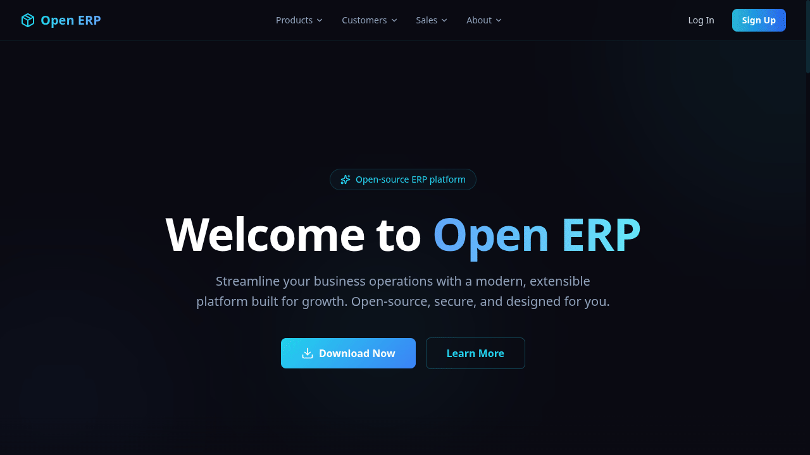
  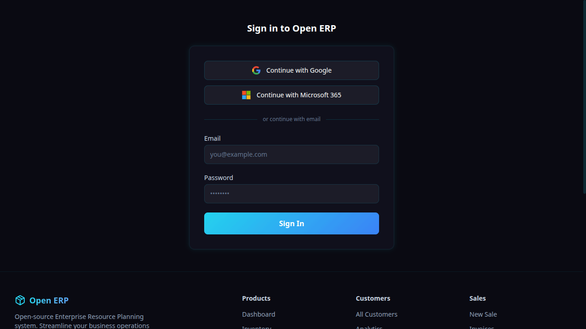
  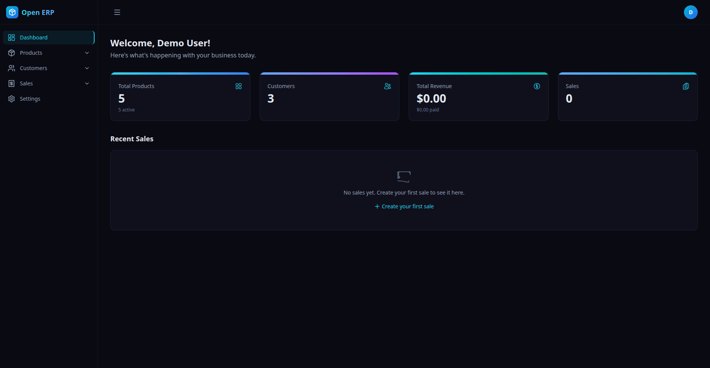
</p>

### 🖼️ Screenshot Gallery

<details>
<summary><strong>Click to expand — full dashboard gallery</strong></summary>
<br />

<table>
  <tr>
    <td width="50%" align="center">
      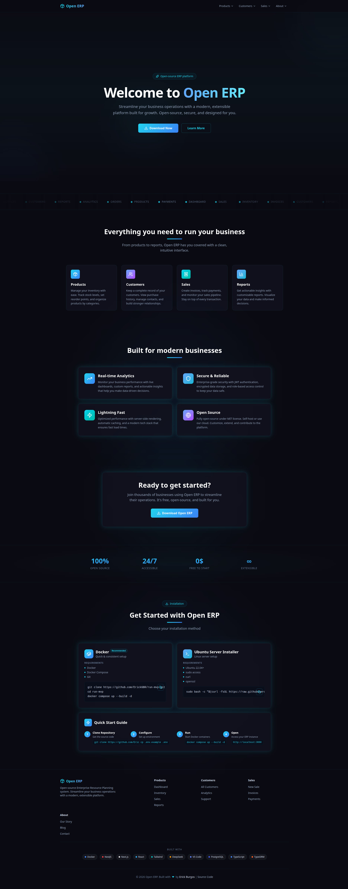
      <br /><em>Landing Page — Hero</em>
    </td>
    <td width="50%" align="center">
      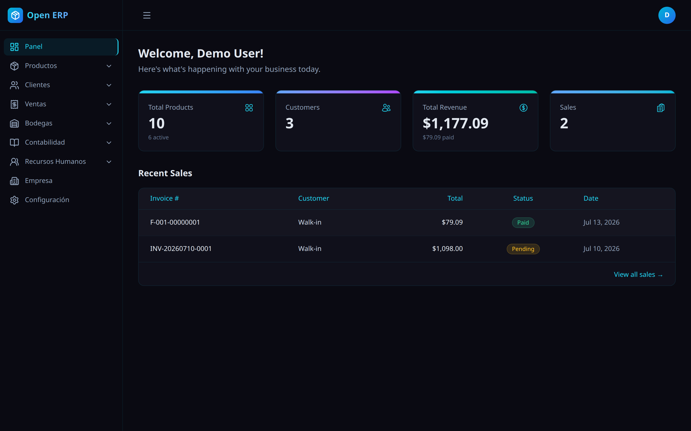
      <br /><em>Dashboard Overview</em>
    </td>
  </tr>
  <tr>
    <td width="50%" align="center">
      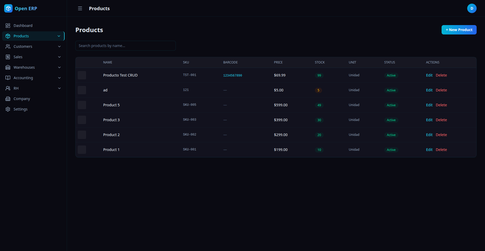
      <br /><em>Products Management</em>
    </td>
    <td width="50%" align="center">
      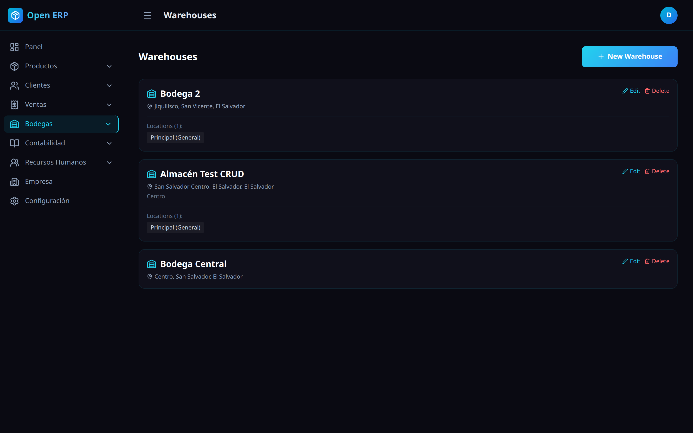
      <br /><em>Warehouse & Inventory</em>
    </td>
  </tr>
  <tr>
    <td width="50%" align="center">
      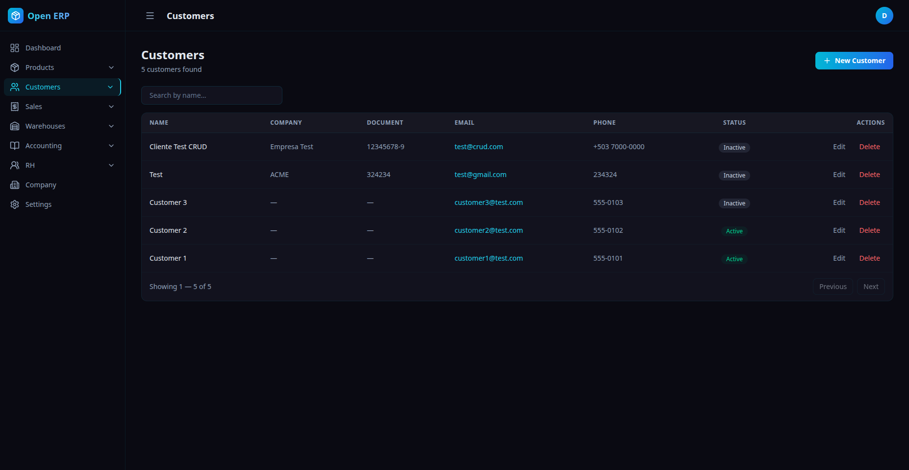
      <br /><em>Customer Registry</em>
    </td>
    <td width="50%" align="center">
      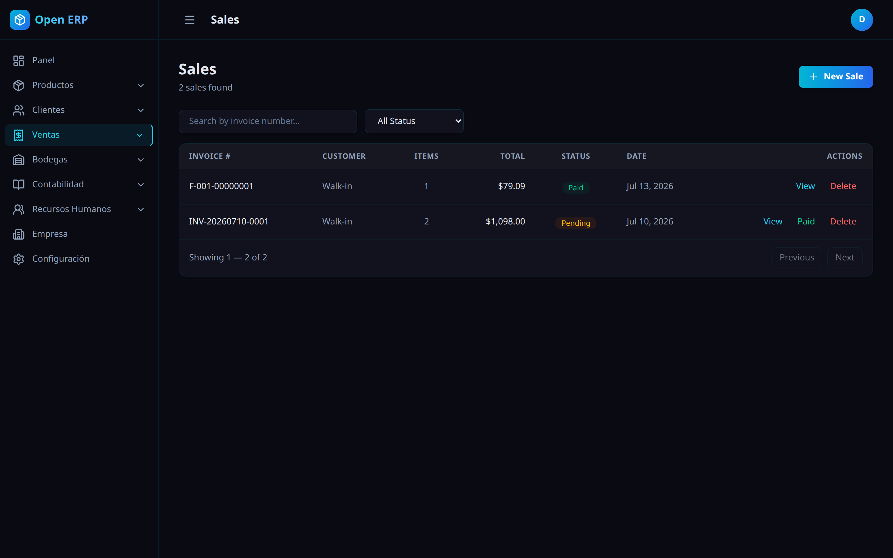
      <br /><em>Sales & Invoices</em>
    </td>
  </tr>
  <tr>
    <td width="50%" align="center">
      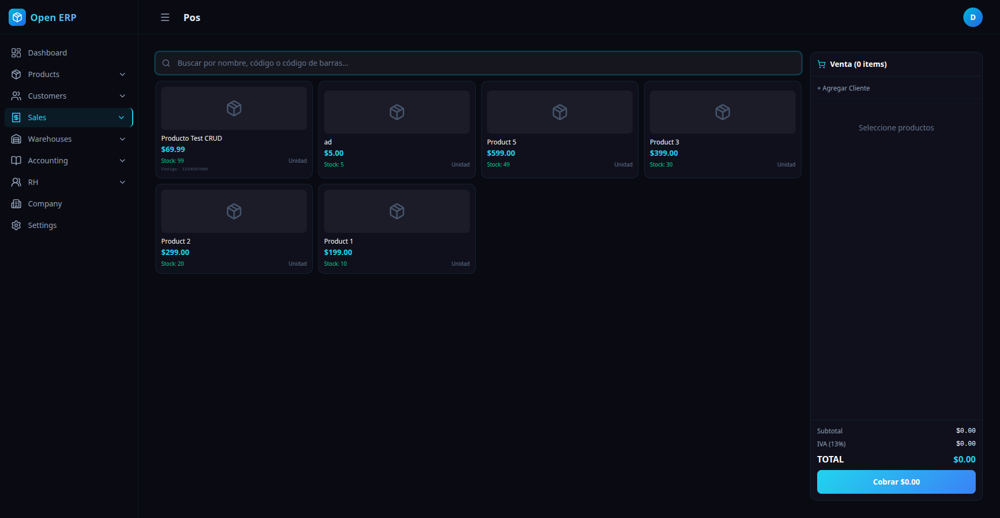
      <br /><em>Point of Sale (POS)</em>
    </td>
    <td width="50%" align="center">
      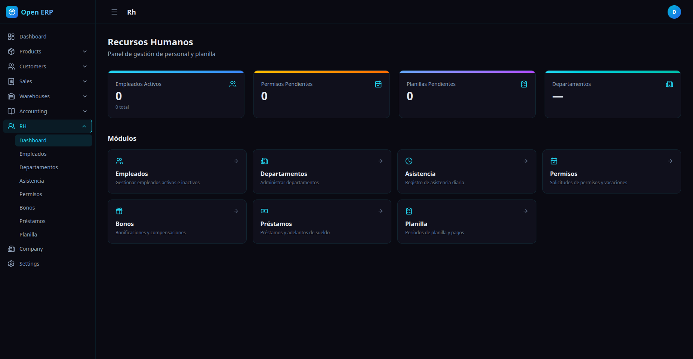
      <br /><em>RH Dashboard</em>
    </td>
  </tr>
  <tr>
    <td width="50%" align="center">
      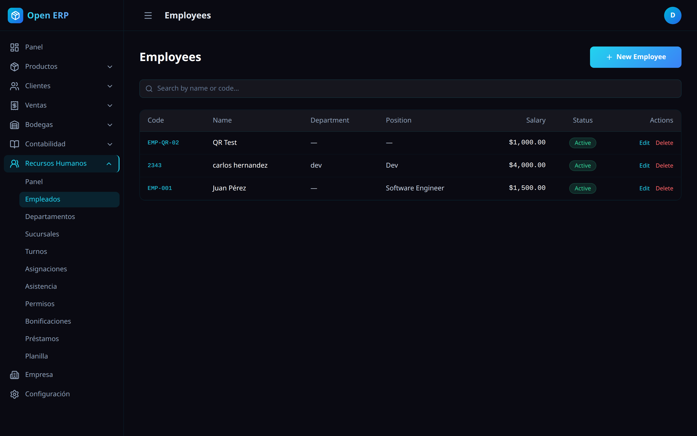
      <br /><em>Employee Management</em>
    </td>
    <td width="50%" align="center">
      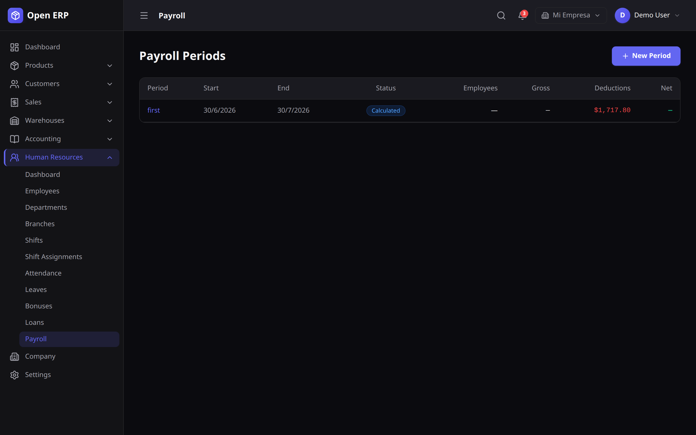
      <br /><em>Payroll Management</em>
    </td>
  </tr>
  <tr>
    <td width="50%" align="center">
      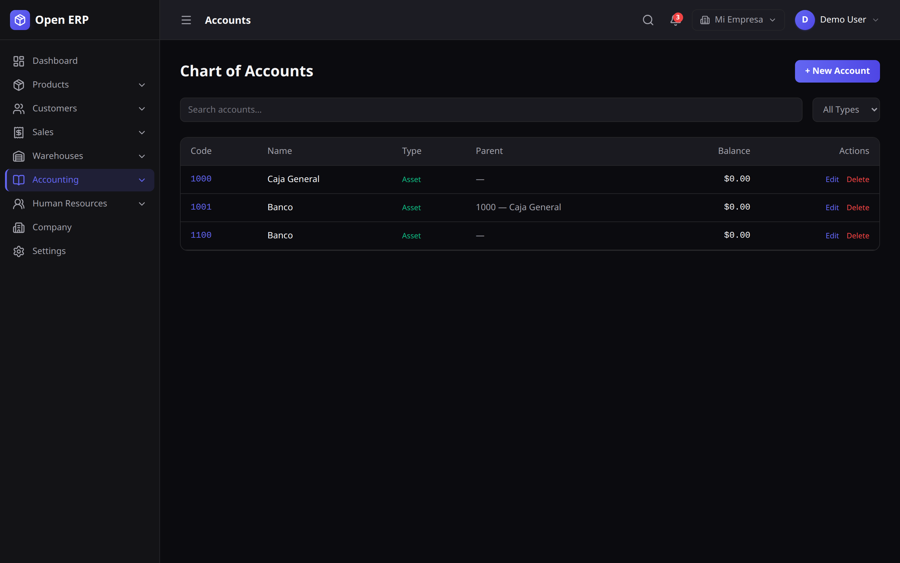
      <br /><em>Chart of Accounts</em>
    </td>
    <td width="50%" align="center">
      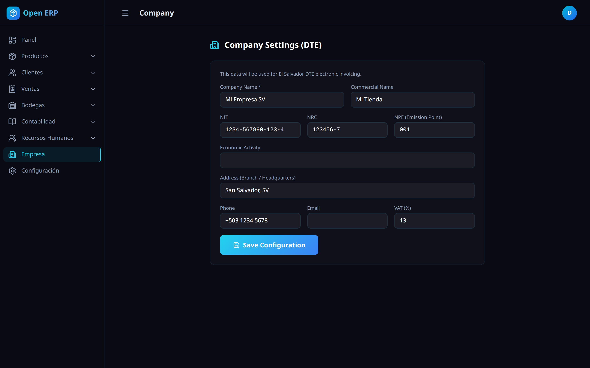
      <br /><em>Company Settings</em>
    </td>
  </tr>
</table>

</details>

<br />

</div>

## 👨‍💻 Author

**Erick Burgos** — [GitHub](https://github.com/ErickGBR) — [Email](mailto:eburgos.web.developer@gmail.com)

## 📄 License

**Creative Commons Attribution-NonCommercial 4.0 International (CC BY-NC 4.0)**

Copyright © 2026 **Erick Burgos**

This work is licensed under the **Creative Commons Attribution-NonCommercial 4.0 International License**.

You are **free** to:
- **Share** — copy and redistribute the material in any medium or format
- **Adapt** — remix, transform, and build upon the material

Under the following **terms**:
- **Attribution** — You must give appropriate credit to the original author
- **NonCommercial** — You may **not** use the material for commercial purposes

For commercial use, licensing, or collaboration inquiries, contact the author.

Full license: [CC BY-NC 4.0 Legal Code](https://creativecommons.org/licenses/by-nc/4.0/legalcode)
